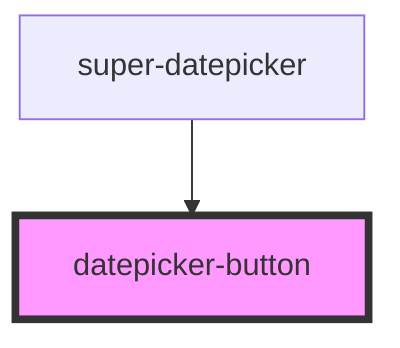

# datepicker-button

<!-- Auto Generated Below -->

## Properties

| Property     | Attribute    | Description                                                        | Type      | Default |
| ------------ | ------------ | ------------------------------------------------------------------ | --------- | ------- |
| `bordered`   | `bordered`   | Whether a border will appear around the button                     | `boolean` | `false` |
| `compact`    | `compact`    | Whether the button is an icon button                               | `boolean` | `false` |
| `selectable` | `selectable` | Whether the button is selectable                                   | `boolean` | `false` |
| `selected`   | `selected`   | Whether the button is selected. Works only if `selectable` is true | `boolean` | `false` |

## Dependencies

### Used by

 - [super-datepicker](../datepicker)

### Graph

----------------------------------------------

*Built with [StencilJS](https://stenciljs.com/)*
