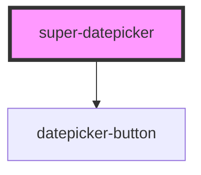

# datepicker

<!-- Auto Generated Below -->

## Properties

| Property           | Attribute            | Description                                                                                                          | Type                          | Default      |
| ------------------ | -------------------- | -------------------------------------------------------------------------------------------------------------------- | ----------------------------- | ------------ |
| `date`             | --                   | Selected date Note: Shouldn't be used with `range`. If both `range` and `date` are set, `range` will be prioritized. | `Date`                        | `new Date()` |
| `startsFromMonday` | `starts-from-monday` | Whether the calender starts from sunday or monday                                                                    | `boolean`                     | `undefined`  |
| `view`             | `view`               | The current view of the datepicker                                                                                   | `"date" \| "month" \| "year"` | `'date'`     |
| `yearViewCount`    | `year-view-count`    | The number of years to be shown in a single view                                                                     | `number`                      | `20`         |

## Events

| Event           | Description                                                | Type               |
| --------------- | ---------------------------------------------------------- | ------------------ |
| `dateSelected`  | Fired when date(1 - 31, not the Date() object) is selected | `CustomEvent<any>` |
| `monthSelected` | Fired when month is selected                               | `CustomEvent<any>` |
| `yearSelected`  | Fired when year is selected                                | `CustomEvent<any>` |

## CSS Custom Properties

| Name                     | Description                 |
| ------------------------ | --------------------------- |
| `--header-background`    | Background of the header    |
| `--main-area-background` | Background of the main area |

## Dependencies

### Depends on

- [datepicker-button](../button)

### Graph

----------------------------------------------

*Built with [StencilJS](https://stenciljs.com/)*
