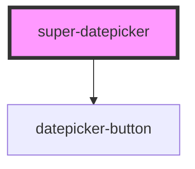

# datepicker

<!-- Auto Generated Below -->

## Properties

| Property | Attribute | Description                                                                                                          | Type                          | Default      |
| -------- | --------- | -------------------------------------------------------------------------------------------------------------------- | ----------------------------- | ------------ |
| `date`   | `date`    | Selected date Note: Shouldn't be used with `range`. If both `range` and `date` are set, `range` will be prioritized. | `Date \| number \| string`    | `new Date()` |
| `view`   | `view`    | The current view of the datepicker                                                                                   | `"date" \| "month" \| "year"` | `'date'`     |

## Dependencies

### Depends on

- [datepicker-button](../button)

### Graph

----------------------------------------------

*Built with [StencilJS](https://stenciljs.com/)*
